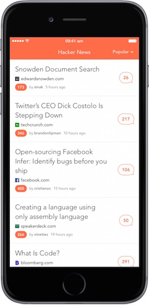

# HackerNews for iPhone
An open source, beautifully designed Hacker News client for iPhone

## Setup

Run `pod install` providing a Crashlytics key.

## Credits

Designed by [@caicardenas](https://twitter.com/caicardenas)

## Contributing

I could use a little help :)  
See [the issues](https://github.com/MarcoSero/HackerNews/issues) currently open.

## Contact

Marco Sero

- http://www.marcosero.com
- http://twitter.com/marcosero 
- marco@marcosero.com

## License

HackerNews for iPhone is available under the MIT license. See the LICENSE file for more info.
